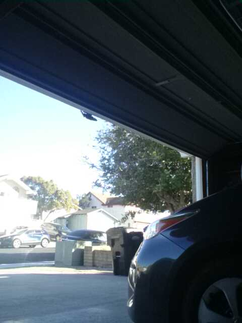

# Is the garage door open?

| Door Shut | Door Open |
|-----------|-----------|
|  |  |

In the past, I may have left the house with the garage door open. Never again!

## Overview

* IP camera app runs on old Android phone, mounted in the garage
* this script runs on a nuc on the same network
* script performs the actions:
    * fetch latest image from phone
    * send off to gemini, ask if the door is open
    * if open, send notification to my phone via ntfy
* script runs on a cron job at specified timings, chosen to stay within daily free tier limits for gemini

## Notes
* before running `export GEMINI_API_KEY=<secret>`
    * find key at https://aistudio.google.com/api-keys?projectFilter=gen-lang-client-0556689288
* tried moondream - only accepted one image per query, also slow CPU only, and got first query wrong, so switched to gemini